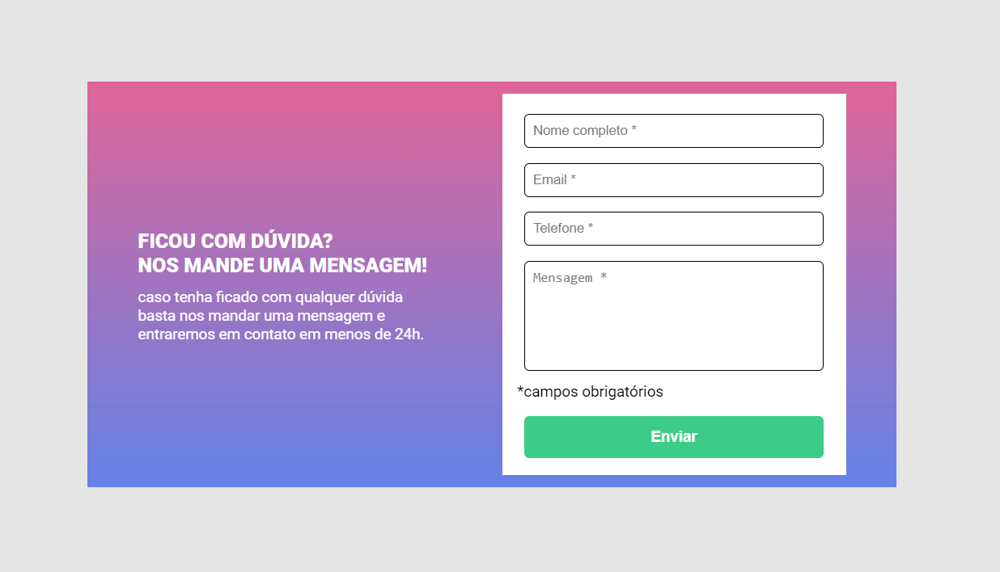
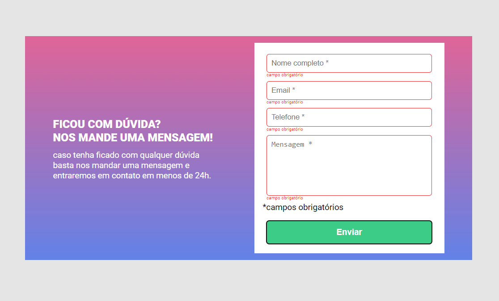
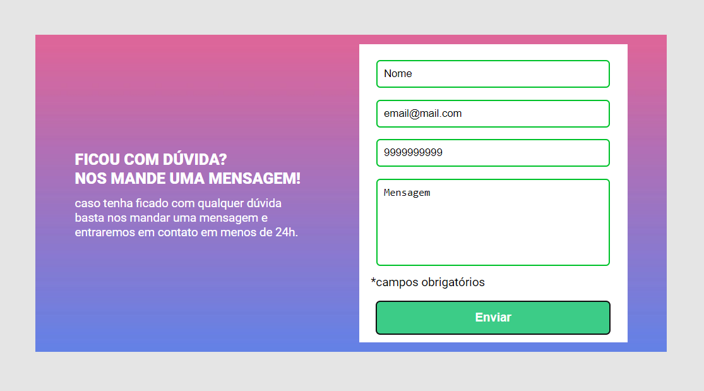
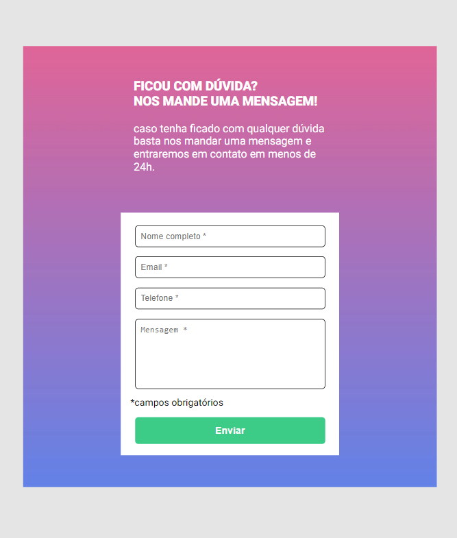

---

# Formulário com Validação em JavaScript

Este projeto é um formulário com validação em JavaScript, desenvolvido como desafio do curso **DevQuest**. O formulário verifica se os campos obrigatórios foram preenchidos e realiza validações adicionais para o campo de e-mail e telefone utilizando expressões regulares (regex).

## Funcionalidades

- Validação de campos obrigatórios (Nome, E-mail, Telefone, Mensagem).
- Validação de formato de e-mail.
- Validação de formato de telefone.
- Exibição de mensagens de erro para cada campo.

## Tecnologias Utilizadas

- HTML5
- CSS3
- JavaScript

## Link do projeto ativo
[Click Aqui](https://formulario-com-validacao-javascript.netlify.app/)

## Exemplo de Validação

- **E-mail**: O e-mail deve seguir o formato `exemplo@dominio.com`.
- **Telefone**: O telefone deve seguir o formato `(XX) XXXXX-XXXX`.

## Prints de Tela

## Desafio DevQuest

Este projeto foi desenvolvido como desafio do curso **DevQuest**, onde pude aplicar meus conhecimentos em HTML, CSS e JavaScript para criar um formulário interativo com validações de campo.

## Agradecimentos

Gostaria de agradecer ao curso **DevQuest** pela oportunidade de aprender e desenvolver este projeto. Agradeço especialmente aos instrutores e à comunidade DevQuest pelo apoio e pelas valiosas lições.